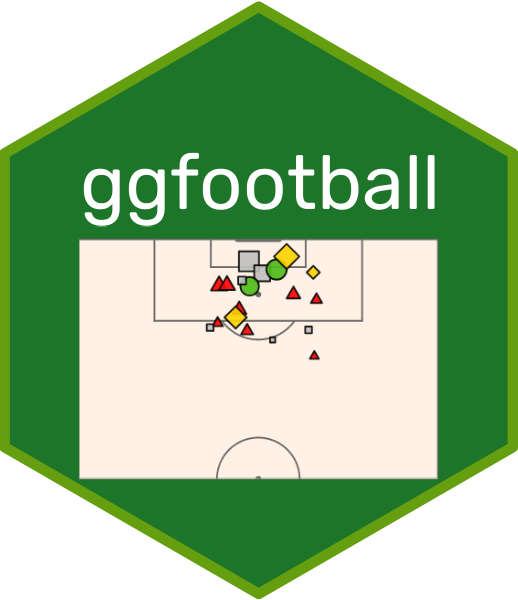

<!-- README.md is generated from README.Rmd. Please edit that file -->

```{r, include = FALSE}
knitr::opts_chunk$set(
  collapse = TRUE,
  comment = "#>",
  fig.path = "man/figures/README-",
  out.width = "100%"
)
```

# ggfootball 

<!-- badges: start -->

[](https://lifecycle.r-lib.org/articles/stages.html#experimental)
<!-- badges: end -->

An R package for plotting [understat](understat.com) data; an xG chart and a shot map.

## Installation

You can install the development version of ggfootball from [GitHub](https://github.com/) with:

``` r
pak::pak("aymennasri/ggfootball")
```

## Example

```{r eval=FALSE}
library(ggfootball)

# xG chart
xg_chart(match_id = 26631, 
         home_team_color = "red", 
         away_team_color = "grey", 
         competition = "Premier League")

# Shot/xG map
shot_map(match_id = 26631, title = "Shot Map")
```

## Acknowledgements

- [Ewen Henderson](https://ewen.io/) for his amazing [{understatr}](https://ewenme.github.io/understatr/) package which I used to extract data.

- [Guangchuang YU](https://yulab-smu.top/) for his [{hexSticker}](https://github.com/GuangchuangYu/hexSticker) package which I used to create the logo for this package.
